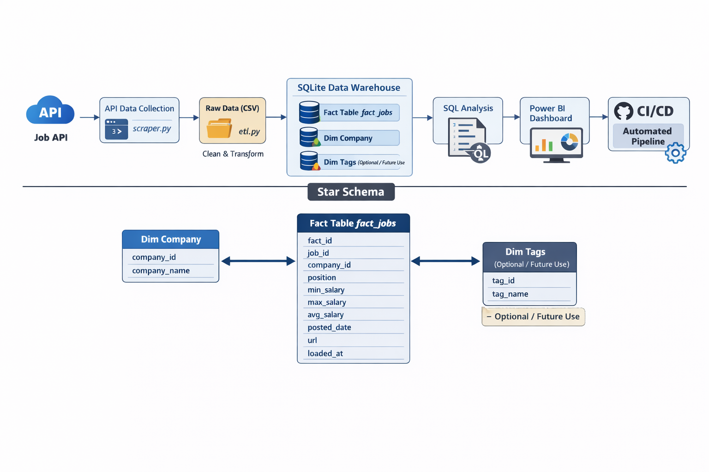

# 🛠️ Job Data Engineering Pipeline

## Overview


This project demonstrates an end-to-end Data Engineering pipeline for collecting, transforming, and analyzing job postings.
All data is ingested via an API (no web scraping), cleaned, and loaded into a SQLite Data Warehouse following a star schema.

---



## 🗂️ Project Structure

job-data-engineering-pipeline/
│
├─ .github/workflows   # CI/CD automation
├─ data/raw            # Raw API data
├─ data/processed      # Cleaned & ready-to-load data
├─ scraper/            # API fetching scripts
├─ pipeline/           # ETL & loader scripts
├─ database/           # Star schema SQL
├─ analysis/           # SQL queries for insights
├─ dashboard/          # Power BI dashboards
├─ README.md
└─ requirements.txt
---

## 💡 Data Warehouse (Star Schema)

**Fact Table: `fact_jobs`** – central job postings

* `fact_id` | `job_id` | `company_id` | `position` | `min_salary` | `max_salary` | `avg_salary` | `posted_date` | `url` | `loaded_at`

**Dimension Tables:**

* `dim_company` → `company_id`, `company_name`
* `dim_tags` → `tag_id`, `tag_name`

```
dim_company
    |
    v
fact_jobs
    |
    v
dim_tags
```

---

## 🔄 Pipeline Flow
```
```
Job API
  ↓
scraper/scraper.py → data/raw/jobs.csv
  ↓
pipeline/etl.py → cleaned & transformed
  ↓
pipeline/loader.py → SQLite DW
  ↓
analysis/queries.sql → insights
  ↓
dashboard/jobs_dashboard.pbix → Power BI visuals
  ↓
.github/workflows/pipeline.yml → automation
```
---

## 📊 Examples of SQL Analysis
```
* Jobs per company
* Average salary per position
* Job trends over time

---

## ⚙️ CI/CD

* Monthly or manual pipeline runs
* Updates raw, processed, and warehouse data
* Pushes changes to GitHub

---

## 🌱 Future Plans

* Add more dimensions (location, job type, experience)
* Deploy to cloud database
* Live dashboards with real-time updates
* Integrate more job APIs

---

Diagram (Star Schema)
```
                    +-------------------+
                    |    dim_company    |
                    |-------------------|
                    | company_id (PK)   |
                    | company_name      |
                    +---------+---------+
                              |
                              |
                              |
                      +-------+-------+
                      |    fact_jobs   |
                      |---------------|
                      | fact_id (PK)  |
                      | job_id        |
                      | company_id FK |
                      | position      |
                      | min_salary    |
                      | max_salary    |
                      | avg_salary    |
                      | posted_date   |
                      | url           |
                      | loaded_at     |
                      +-------+-------+
                              |
                              |
                              |
                    +---------+---------+
                    |      dim_tags     |
                    |-------------------|
                    | tag_id (PK)       |
                    | tag_name          |
                    +-------------------+
---
```
## 👤 Author

**Apurva** – Data Engineering Student
Skills: Python ETL, API ingestion, SQL, Data Warehousing, Power BI, CI/CD

---
